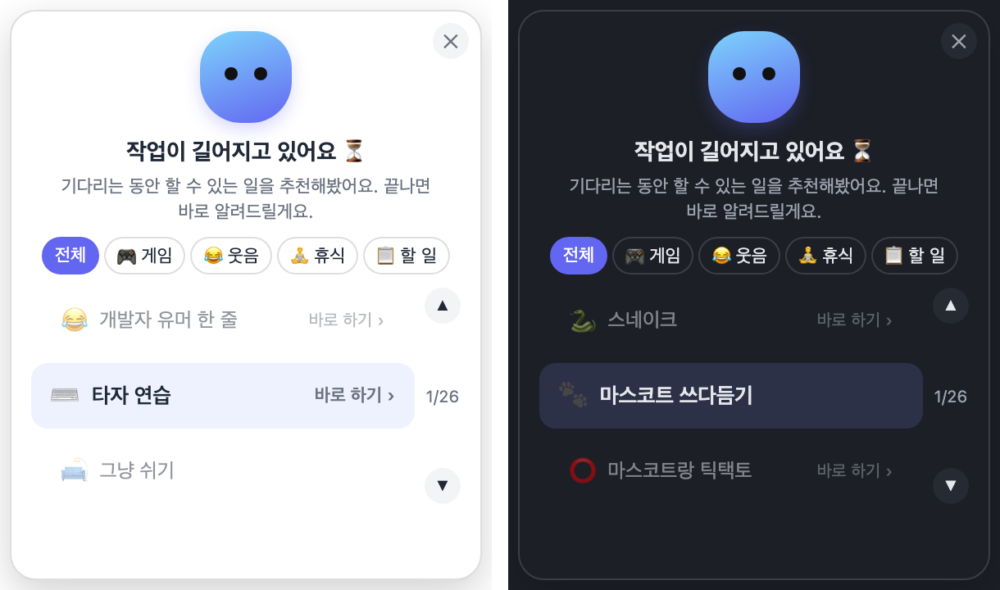
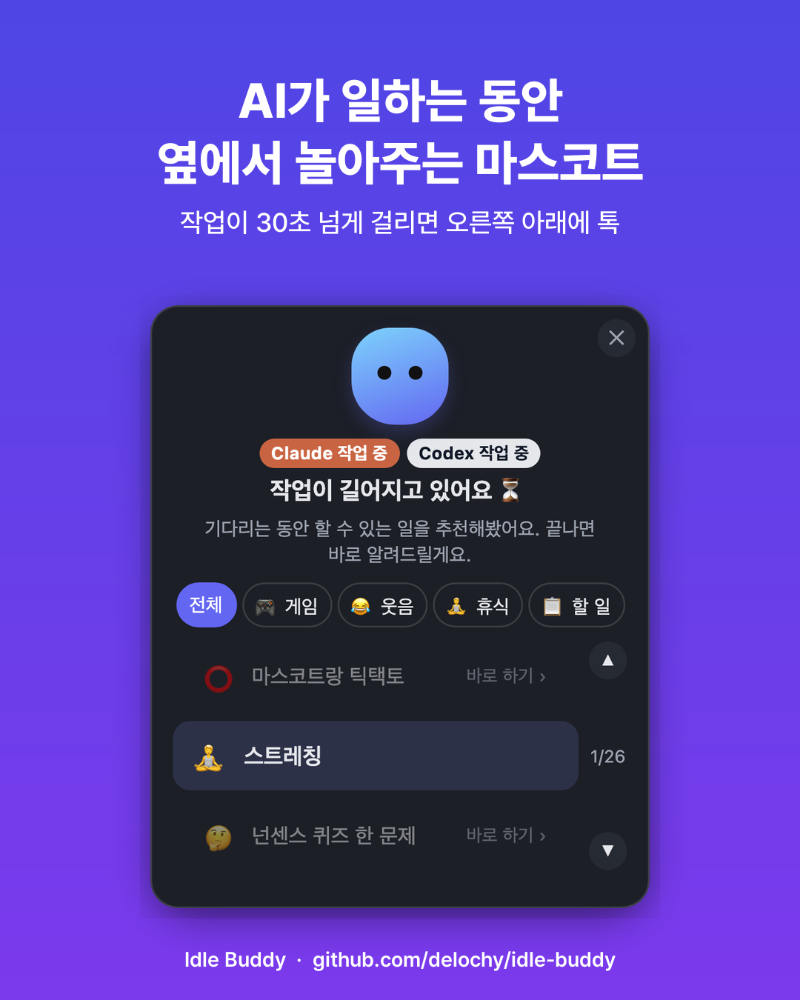
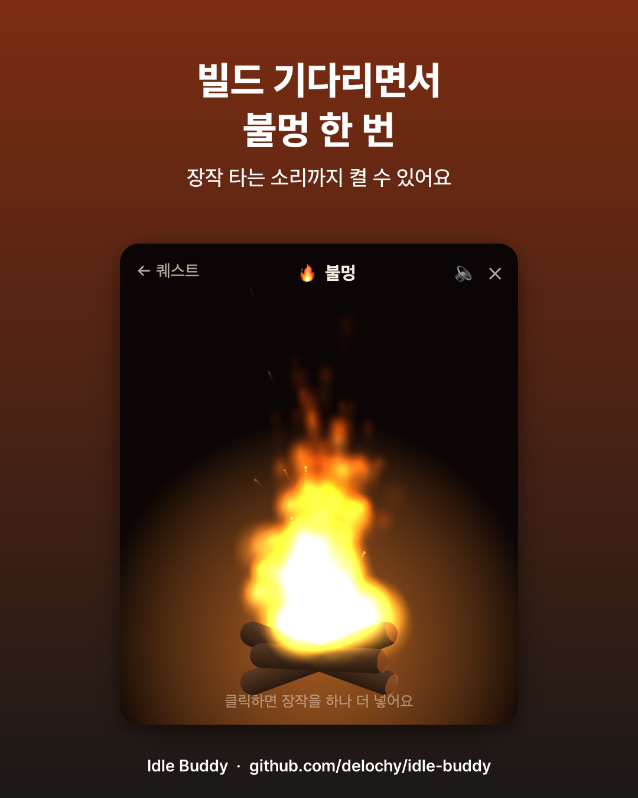
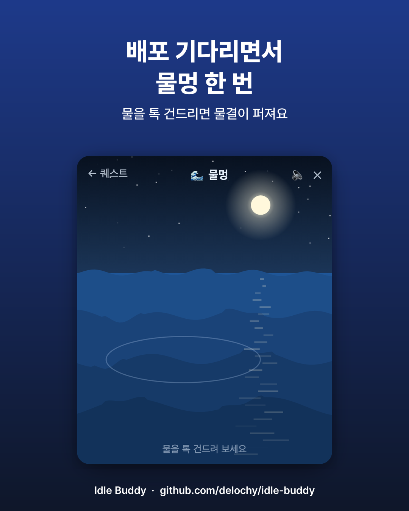
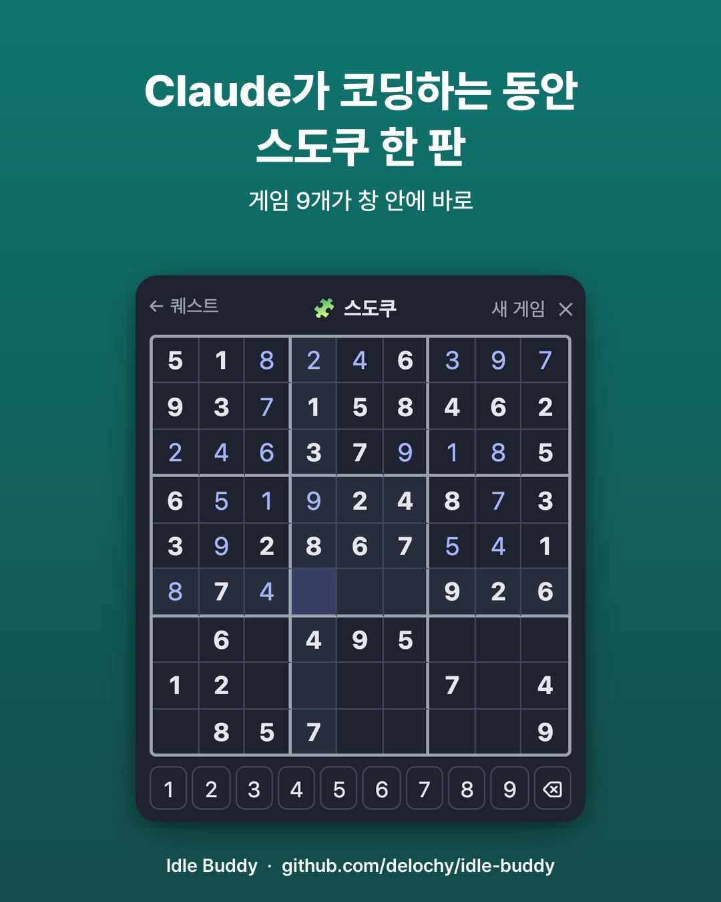
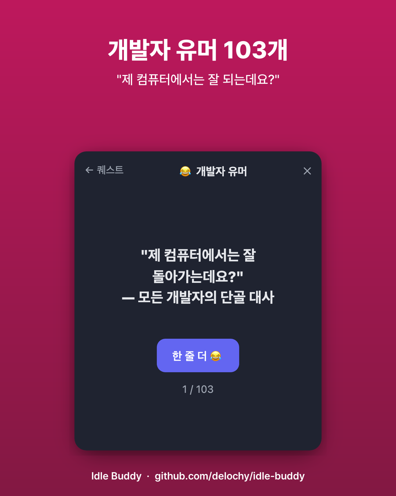
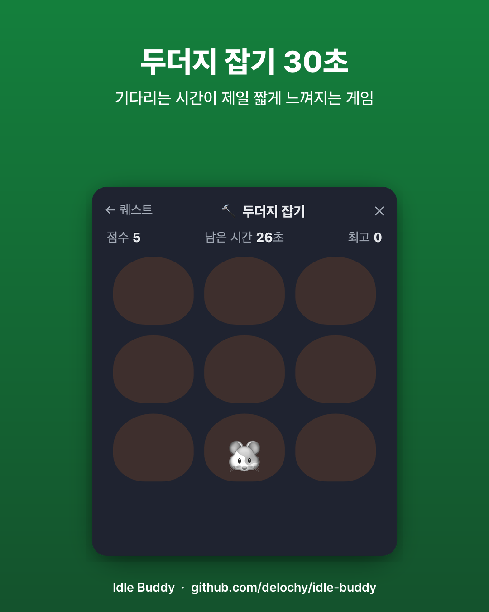
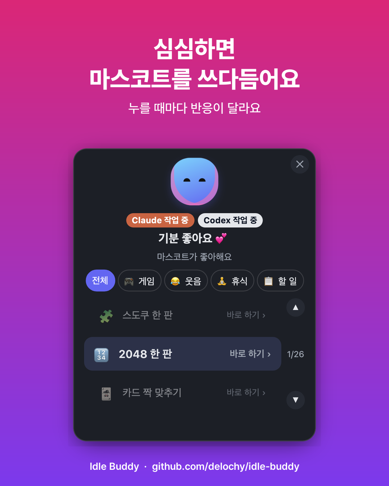
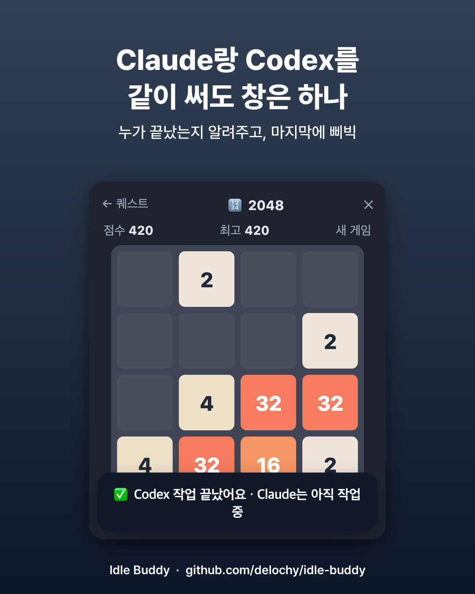
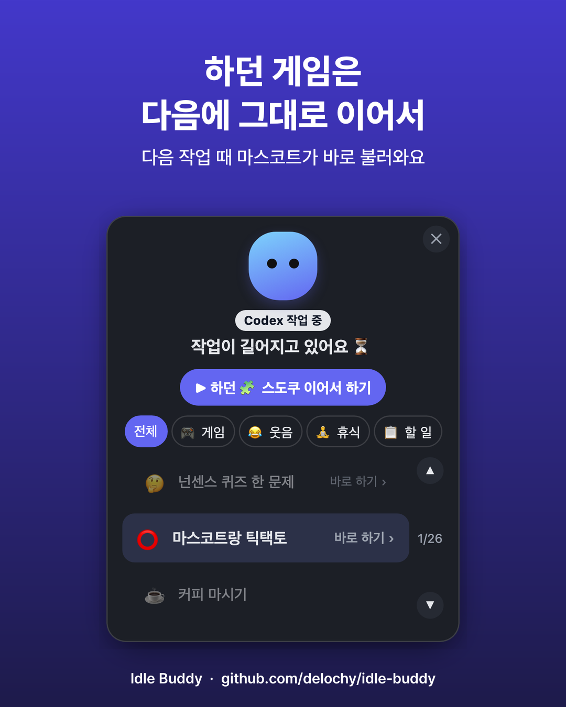

# Idle Buddy 🫧

**AI가 일하는 동안, 옆에서 놀아주는 마스코트.**

Claude Code나 Codex에 일을 시켜놓고 멍하니 로딩만 보고 있던 적 있나요?
Idle Buddy는 작업이 30초 넘게 걸리면 화면 오른쪽 아래에 작은 마스코트를 띄워서
기다리는 동안 할 만한 걸 추천해줘요. 작업이 끝나면 "삐빅" 하고 스르륵 사라져요.

<p align="center"></p>

- 🎮 **창 안에서 바로 하는 게임 9개**: 스도쿠, 2048, 지뢰찾기, 스네이크, 두더지 잡기, 틱택토, 짝 맞추기, 반응속도, 타자 연습…
- 😂 **웃음**: 개발자 유머 100여 개, 넌센스 퀴즈 90여 개 (한 번 본 건 다 볼 때까지 안 나와요)
- 🧘 **휴식**: 불멍 🔥, 물멍 🌊 (소리도 있어요), 숨 고르기, 스트레칭
- 📋 **할 일**: 장보기 목록, 바탕화면·다운로드 폴더 정리, 밀린 카톡 답장… (누르면 해당 앱이 열려요)

- 🔁 **이어하기**: 작업이 끝나 마스코트가 사라져도, 다음에 뜰 때 하던 게임·장보기를 그대로 불러와요.
- 🤝 **Claude·Codex 같이 써도 창은 하나**: 누가 작업 중인지 표시하고, 누가 끝났는지 알려줘요. 종료 소리도 서로 달라요.

서버도 계정도 없어요. 전부 내 맥 안에서만 돌아가요.

> 코드 안의 내부 이름(MCP 서버 `ai-side-quest`, 앱 `AI Side Quest Mascot`)은 처음 프로젝트 이름을 그대로 써요.

## 둘러보기

<table>
<tr><td></td><td></td></tr>
<tr><td></td><td></td></tr>
<tr><td></td><td></td></tr>
<tr><td></td><td></td></tr>
<tr><td></td><td></td></tr>
</table>

## 어떻게 동작하나요

```
Claude Code / Codex ──(훅)──▶ data/state.json ◀──(2초마다 읽기)── 마스코트 위젯 (macOS 앱)
                                                                     │
                                          로컬 페이지 http://127.0.0.1:4318/quest (게임·추천)
```

1. 프롬프트를 보내면 훅이 "작업 시작"을 기록해요.
2. 30초가 넘도록 안 끝나면 마스코트가 떠요. 이때 **키보드로 타이핑 중이면 손을 멈출 때까지 기다렸다가** 떠요. 포커스도 뺏지 않아요.
3. 작업 규모에 맞춰 추천이 달라져요. Claude가 작업 규모(짧음/중간/긺)를 알려주고, 생각보다 길어지면 추천도 긴 걸로 바뀌어요. 화면에 "N분 걸려요" 같은 숫자는 보여주지 않아요.
4. 그 작업이 끝나면 삐빅 울리고 사라져요.

## 필요한 것

- **macOS** (마스코트 위젯은 지금 macOS만 지원)
- **Node.js 18+**
- **Rust**: 마스코트 앱을 내 컴퓨터에서 빌드하는 데 필요해요. 없으면 설치 스크립트가 설치 명령을 알려줘요.
- **Claude Code**나 **Codex** 중 하나 이상

## 설치

```bash
git clone https://github.com/delochy/idle-buddy.git
cd idle-buddy
sh install.sh
```

설치 스크립트가 하는 일:

1. **Claude Code 연결**: `~/.claude/settings.json`에 훅을 추가하고, MCP 서버를 등록해요.
2. **Codex 연결** (설치돼 있으면): `~/.codex/hooks.json`에 훅을 추가하고, MCP 서버를 등록해요.
3. **마스코트 앱**을 빌드해서 `~/Applications/AI Side Quest Mascot.app`에 설치하고 실행해요.

바꾸는 설정 파일은 모두 `.bak-<시간>` 파일로 먼저 백업해요. 설치 후에는 **실행 중인 Claude Code / Codex 세션을 새로 열어야** 적용돼요.

**로그인할 때 자동 실행**: 시스템 설정 → 일반 → 로그인 항목에 `AI Side Quest Mascot`을 추가하세요. 앱은 메뉴바나 Dock에 안 보이는 백그라운드 앱이에요.

**Codex 사용자**: Codex는 새 훅을 처음 한 번 **신뢰**해줘야 실행해요. 신뢰하지 않으면 훅이 조용히 무시돼요. 설치 후 터미널에서 `codex`를 한 번 실행하면 "Hooks need review" 화면이 떠요. 거기서 **Trust all and continue**를 고르세요. Codex 데스크톱 앱만 쓰는 경우에도 이 단계는 터미널에서 한 번 해야 해요.

## 제거

```bash
node uninstall.js
```

훅, MCP 서버 등록, 마스코트 앱을 지워요. 바꾸는 파일은 백업하고, 저장소 폴더와 `data/` 기록은 남겨둬요.

## 개인정보

- 모든 데이터는 `data/` 폴더에만 저장되고 어디로도 전송되지 않아요. 저장되는 건 작업 시작·종료 시각, 작업 폴더, 프롬프트 앞 200자, 고른 퀘스트예요.
- 타이핑 감지는 **마지막으로 키가 눌린 시각**만 봐요. 무슨 키였는지는 알 수 없어서 입력 모니터링 권한도 필요 없어요.
- Claude Code 훅은 프롬프트마다 짧은 안내문을 Claude에게 넘겨요. 작업 규모를 알려달라는 부탁과, 시간을 묻거나 "자리 비우세요"라고 말하지 말라는 규칙이에요. 그래서 매번 토큰이 조금 더 들어요.
- 네트워크를 쓰는 건 퀘스트를 눌러 외부 링크를 열 때(Threads 등)뿐이에요.

## 내 마음대로 바꾸기

| 바꾸고 싶은 것 | 파일 |
|---|---|
| 추천 퀘스트 목록 (이름, 이모지, 카테고리, 누르면 열 앱/폴더/URL) | `lib/quests.json` |
| 개발자 유머 / 넌센스 퀴즈 | `mcp/games/jokes.json`, `mcp/games/quiz.json` |
| 창 안 미니 게임 추가 | `mcp/games/<이름>.html`을 만들고 `quests.json`에 `"open": "/games/<이름>"` 한 줄 추가 |
| 뜨는 시점(30초), 타이핑 대기(4초), 사라지는 속도 | `native-widget/src-tauri/src/main.rs` 상단 상수 → `sh setup/install-widget.sh`로 다시 빌드 |

`quests.json`의 퀘스트 한 줄은 이렇게 생겼어요.

```json
{ "id": "kakao", "emoji": "💛", "label": "밀린 카톡 답장하기", "launch": { "app": "KakaoTalk" }, "cat": "todo" }
```

- `launch`에는 `{ "path": "~/Downloads" }`, `{ "url": "https://..." }`, `{ "app": "Music" }` 중 하나를 써요.
- `cat`은 카테고리예요. `game`(게임), `fun`(웃음), `rest`(휴식), `todo`(할 일) 중 하나를 써요.

## 구성

```
install.sh / uninstall.js      설치·제거
setup/                         Claude Code·Codex 연결, 훅 중계 스크립트, 위젯 빌드
lib/                           상태 저장(state.js), 작업 규모 → 추천 단계(estimate.js), 퀘스트 목록
mcp/server.js                  MCP 서버 (Claude/Codex가 쓰는 sidequest_* 도구)
mcp/quest-http.js              마스코트 창에 뜨는 로컬 페이지 (추천 캐러셀·카테고리)
mcp/games/                     창 안 미니 게임·불멍·물멍·장보기
bin/side-quest-daemon.js       위젯이 띄우는 로컬 페이지 서버
native-widget/                 마스코트 앱 (Tauri, 투명·테두리 없는 창)
skill/SKILL.md                 (선택) Claude용 스킬 설명
```

## 알려진 한계

- **macOS 전용이에요.** 훅과 추천 페이지는 다른 OS에서도 돌지만, 마스코트 창은 macOS만 돼요.
- **Codex는 훅을 신뢰해야 동작해요.** 신뢰하기 전에는 훅이 오류 없이 조용히 무시돼요. 마스코트가 안 뜨면 위의 "Codex 사용자" 안내대로 터미널에서 `codex`를 한 번 실행해 주세요. 이미 신뢰한 폴더에서 실행해야 폴더 질문에 막히지 않아요.
- **마스코트 앱은 서명되지 않았어요.** 내 컴퓨터에서 직접 빌드해서 쓰는 구조예요.

## English (short)

**Idle Buddy** is a tiny desktop mascot for macOS that pops up when a Claude Code or Codex task runs longer than 30 seconds. While you wait, it suggests something to do: 9 built-in mini games, dev jokes, riddles, a campfire or ocean to zone out to, or a quick chore that opens the right app. When the task finishes, it beeps and fades away. It never pops up while you're typing. Everything runs locally, with no server and no account.

Install with `sh install.sh` (you need macOS, Node 18+, and Rust). Uninstall with `node uninstall.js`. The UI text is in Korean for now.

## License

[MIT](LICENSE)
